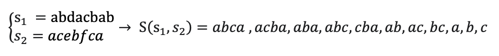

# String Similarity Using Dynamic Programming

## Project Description

When performing a Google search, you may have noticed that if you misspell a word, Google suggests the correct spelling. For example, if you search for "inplememtation," Google provides results for the correctly spelled "implementation."

How does Google achieve this? As a simple solution, we can define criteria to make the best possible prediction of a likely string. Let’s denote the search string as \( S1 \) and the predicted string as \( S2 \). Our criteria should return a measure of similarity between the two strings, from which we can select the most suitable \( S2 \).

### Problem A: Edit Distance

For the first criterion, we consider the edit distance between \( S1 \) and \( S2 \) using three operations: deletion, insertion, and substitution. The cost for deletion and insertion is 1, while the cost for substitution is 2. For example, to transform "index" into "inside," two possible paths are shown:


Using dynamic programming, we compute the minimum cost to transform \( S1 \) into \( S2 \) along with the chosen operations. According to this criterion, the lower the cost, the more suitable the candidate string \( S2 \) will be.


To compute the cost of converting one word into another, the process involves starting from the last characters of both words and considering three cases:

 - Matching Characters: If the last characters of both words are the same, no operation is needed. The cost is 0, and the problem reduces to the remaining substrings.

 - Different Characters: If the last characters differ, we compute the cost of three operations:

Insertion: Insert the last character of the second word into the first.
Deletion: Delete the last character of the first word.
Substitution: Replace the last character of the first word with the last character of the second word. This is like matching but includes the cost of the substitution operation.
- Empty Substring: If either word is empty, the cost is the number of remaining characters in the non-empty word, as all characters need to be inserted.

We use Dynamic programming to solve this by storing results of subproblems in a matrix. The matrix is filled in a bottom-up manner by applying the three cases. By tracing back from the matrix, we can determine the sequence of operations that achieved the minimum cost:

```python
def Min_Edit_Cost(m, n, S1, S2):

    memorization = [[0 for i in range(n + 1)] for j in range(m + 1)]

    for i in range(m + 1):
        for j in range(n + 1):
            if i == 0:
                memorization[i][j] = j    
                memorization[i][j] = i   

            elif S1[i-1] == S2[j-1]:
                memorization[i][j] = memorization[i-1][j-1]
 
            else:
                memorization[i][j] = min(1 + memorization[i][j-1],        # Insert
                                         1 + memorization[i-1][j],        # Remove
                                         2 + memorization[i-1][j-1])    # Replace
 
    return memorization[m][n]
```

Checking the algorithm with the words given in the question, we get the following result:


```python
S1 = 'index'
S2 = 'inside'
m = len(S1)
n = len(S2)
ans = Min_Edit_Cost(m, n, S1, S2)
print('The Min Cost to convert these 2 words to each other = ', ans)
```

```
The Min Cost to convert these 2 words to each other =  3
```


### Problem B: Longest Common Subsequence

For the second criterion, we define the concept of a subsequence of a string. A subsequence of string \( S \) is any subset of its characters that appears in the same order as in \( S \). For example, the string "aca" is a subsequence of the string "abcba."

The longest common subsequence between two strings \( S1 \) and \( S2 \) is the set of characters that appear in both strings as subsequences. For example, consider two strings:





Using dynamic programming, we find the length of the longest common subsequence between two given strings \( S1 \) and \( S2 \). According to this criterion, the longer the length of the common subsequence, the more suitable the candidate string \( S2 \) will be.


